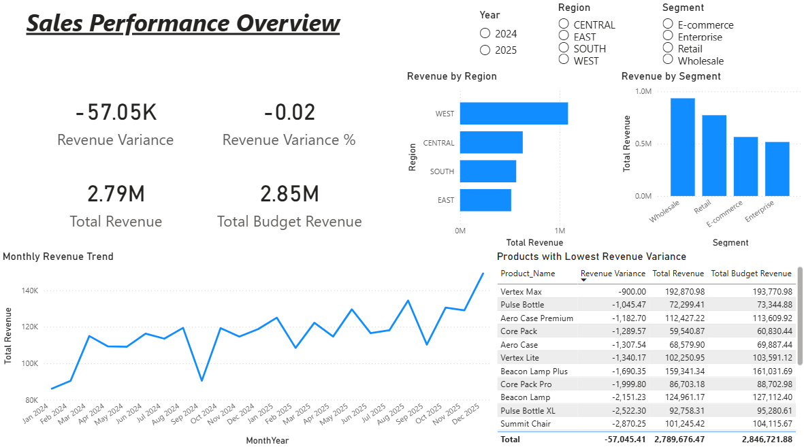
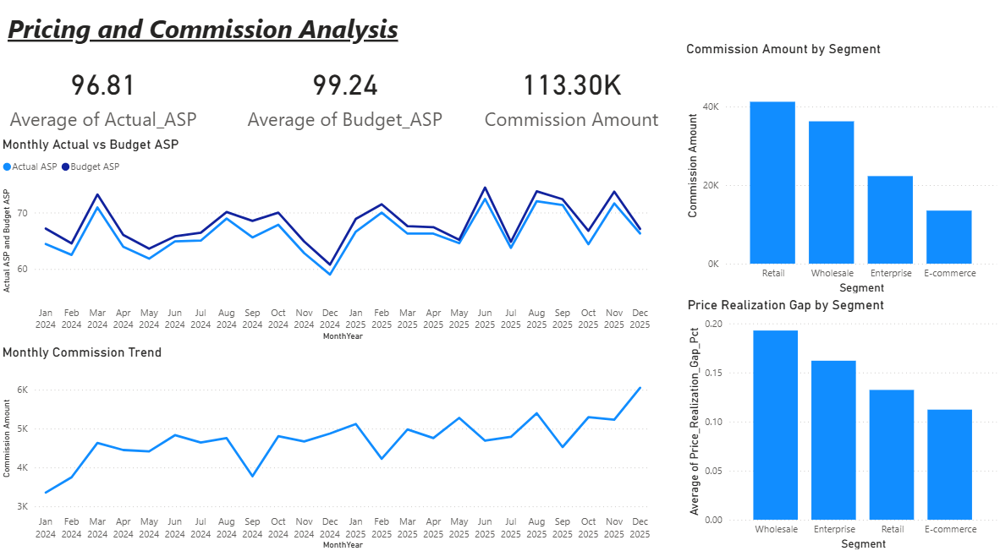
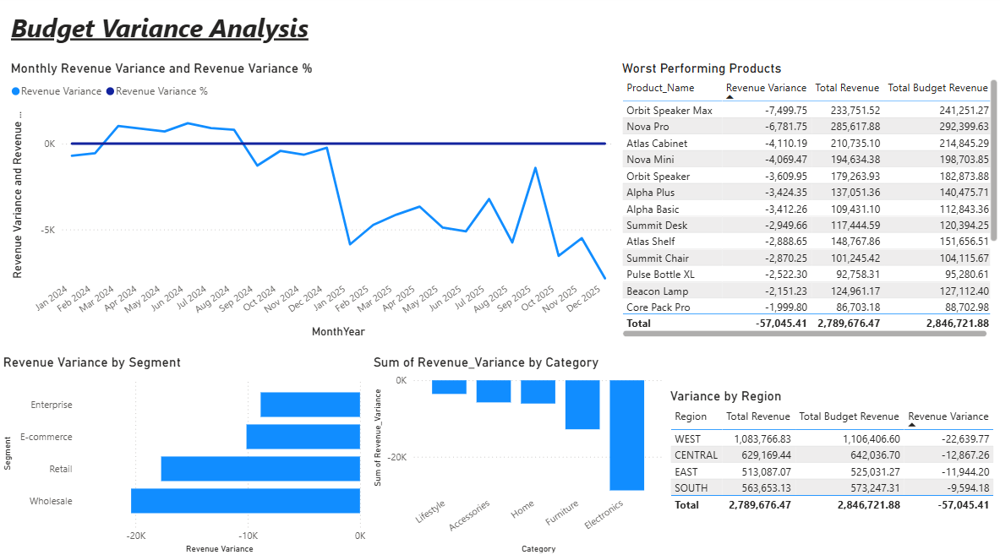
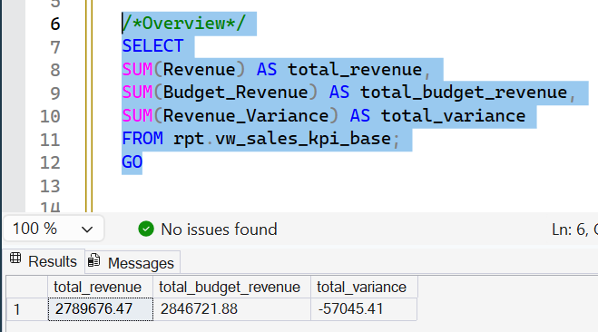
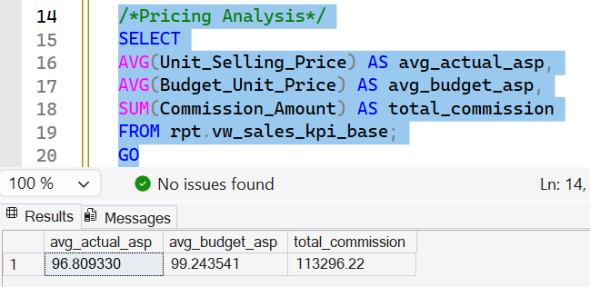
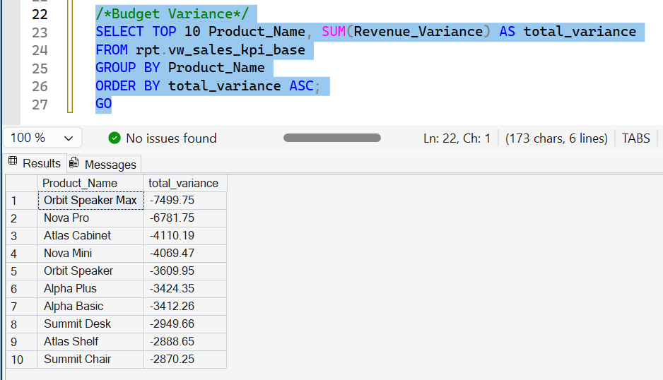

# Sales Pricing & Variance Analysis Dashboard

End-to-end Power BI solution integrating SQL datasets to monitor pricing trends, sales KPIs, and budget variance across market segments. Standardized commission-impact metrics and automated data refresh.

## Features
- 8,000 synthetic sales rows (2024-2025)
- SQL staging and 4 reporting views
- Star schema model with DimDate
- 3 dashboard pages with slicers
- Validated totals against SQL

## Pages
**Overview**: KPI cards, regional/segment breakdowns, monthly trends  
**Pricing Analysis**: ASP trends, discount behavior, commission impact  
**Budget Variance**: Actual vs budget, variance by region/product

## Demo Screenshots
  
  

## SQL Validation Screenshots
  
  

## Setup
1. Run SQL script to create database/views
2. Connect Power BI to SQL Server
3. Load dashboard .pbix file
